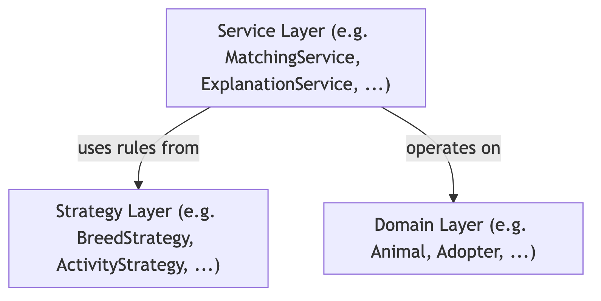
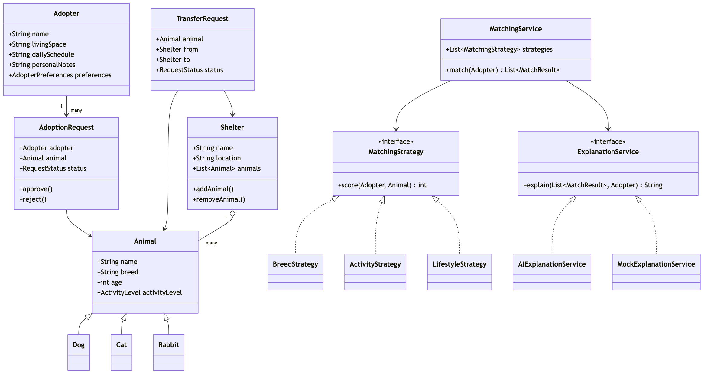

# Project Proposal: Multi-Shelter Animal Adoption Management System

We propose to build a Java-based multi-shelter animal adoption management system that models the workflow between shelters and adopters.
The system manages animals available for adoption, allows adopters to submit adoption requests, supports transferring animals between shelters, and recommends suitable animals based on adopter preferences and living conditions.
The project focuses on a clear object-oriented architecture rather than a complex user interface.

The system is organized into three layers, as shown below:

The domain layer represents the core entities and system state:

- **Animal**: base class with subclasses Dog, Cat, and Rabbit capturing species-specific attributes.
- **Shelter**: holds a collection of animals and manages capacity and location information.
- **Adopter**: represents a prospective adopter, including preference fields and lifestyle context such as living space, daily schedule, and personal notes.
- **AdoptionRequest**: records the relationship between an adopter and a target animal, along with request status.
- **TransferRequest**: models a request to move an animal from one shelter to another.

The service layer coordinates system workflows through the following services:

- **AdoptionService**: manages the lifecycle of adoption requests, from submission and validation to approval or rejection.
- **TransferService**: handles inter-shelter animal transfers, checking availability and updating shelter records accordingly.
- **MatchingService**: applies a configurable set of strategies to score and rank animals for a given adopter.
- **VaccinationService**: tracks vaccination records and schedules follow-up reminders based on animal type and vaccine requirements.
- **RequestNotificationService**: dispatches status updates to adopters and shelter staff when request states change.
- **ExplanationService**: defined as an interface with two implementations — AIExplanationService, which calls an external AI API to generate a natural-language summary of matching results, and MockExplanationService, which returns deterministic output for unit testing. This design keeps the AI call loosely coupled and fully testable.

The strategy layer encapsulates interchangeable rules used by the services, which is where OOD is most clearly reflected.
For example, MatchingService can combine multiple matching strategies such as breed preference, activity level, and lifestyle compatibility, while VaccinationService can apply different vaccination strategies depending on animal type, vaccine requirements, or scheduling intervals.
This design demonstrates abstraction, composition, and extensibility, since new rules can be added without modifying the core services.

The class structure is outlined below **(proposal only, subject to change)**:

The system's core features include animal management, multi-shelter coordination, adoption and transfer workflows, vaccination management, recommendation matching, event notifications, and AI-assisted match explanation.
In the matching workflow, MatchingService first computes structured scores using the strategy pattern; the resulting ranked list is then passed to ExplanationService, which produces a human-readable narrative for each top match.
The AI layer acts as a post-processing step and does not influence scores, preserving the integrity of the OOD strategy design while making demo output more interpretable and engaging.
